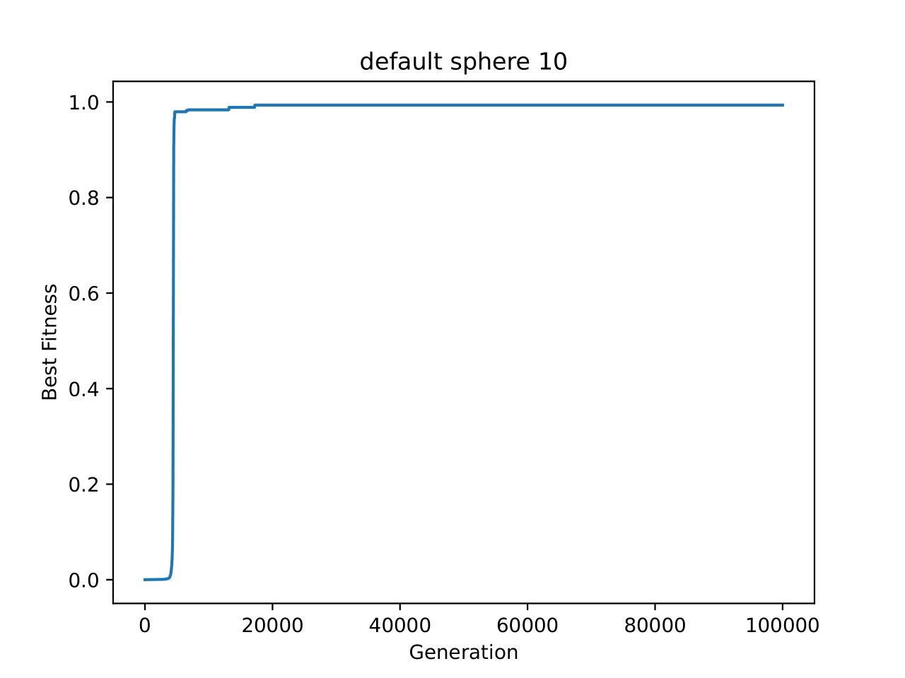
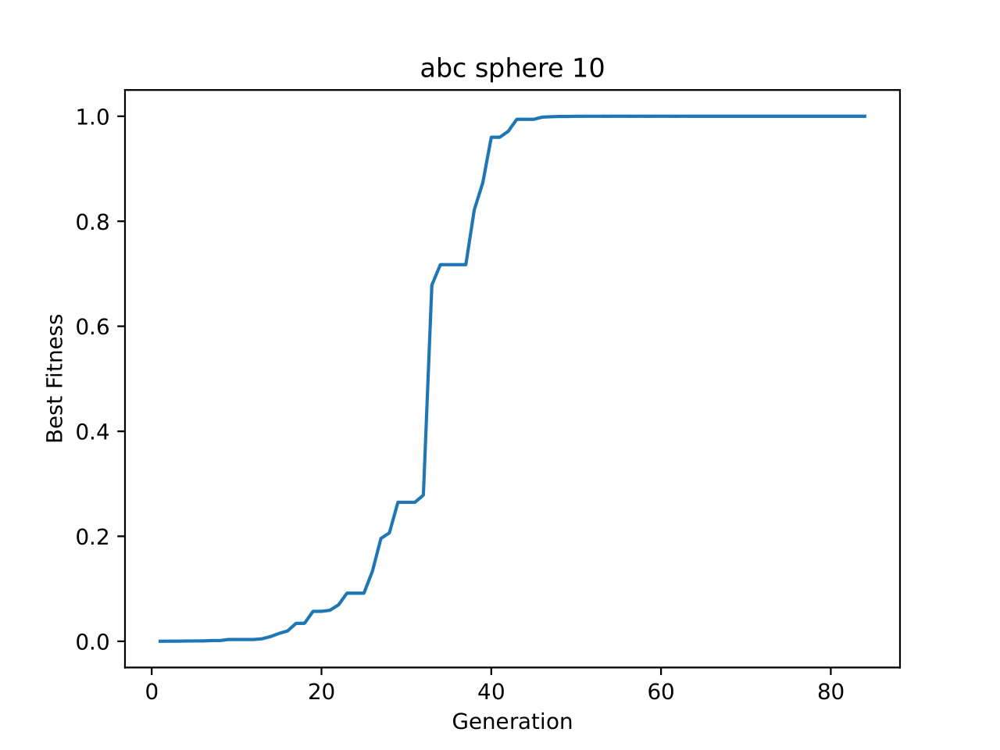

# CVT ABC MAP-Elites

## How to use this program

### Install

- Run the following command

```bash
sudo chmod 755 install.sh
./install.sh
```

- Confirm apps

```bash
$ python3 -V
Python 3.10.12
$ pip -V
pip 22.0.2 from /usr/lib/python3/dist-packages/pip (python 3.10)
```

### Deploy the programs on Docker

- Set the source code into `./src`
- Test `./docker-runner.py`

```bash
python3 docker-runner.py test
```

- Run `./docker-runner.py`

```bash
python3 docker-runner.py
```

## Make the convergence graphs in PDF

- Check the file name of the result data
- Run `./makeplot.py`

```bash
python3 makeplot.py <file path>
```

### Sample graphs

- sample-default-sphere-10



- sample-abc-sphere-10


